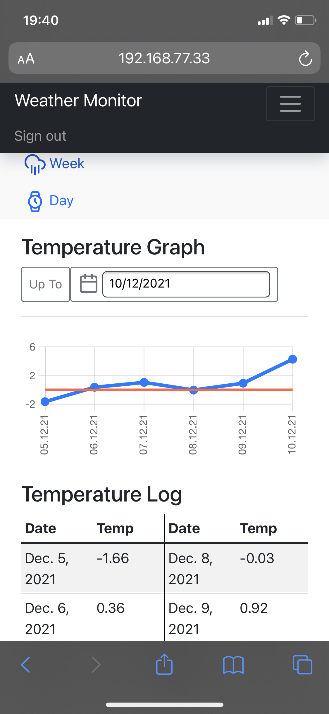

# TempLog4School


[](https://github.com/Polinden/TempLog4School/actions/workflows/second.yml)
[](https://github.com/Polinden/TempLog4School/actions/workflows/main.yml)
</br>
</br>

## USE IT
[Temperature Monitor](http://mishogoda.kiev.ua)

## TRY IT YOUSELF
Assuming you'v got docker and git installed.
Make the settings in place of the asterisks:
- domain name (if not you will have to insert IP in a browser)
- OpenWeather API with api-key (if not it fails to work)
```bash
export DJ_SITE="*****"
export API_W="https://api.openweathermap.org/data/2.5/weather?q=Kyiv&appid=*****&units=metric"
```
and just run in your terminal:
```bash
curl -s https://raw.githubusercontent.com/Polinden/TempLog4School/main/run.sh | sh
```
 
## THEN 
Enjoy...
Docker will do all the dirty job for you 
to launch this Django Weather monitoring pet project
even on Raspbery Pi 4  

## IT COULD HELP
- You to learn:
  - Python & Django
  - Celery
  - JavaScript
  - Webpack
  - Postgres
  - Docker 

- Your kids to trace the temperature (our school, in particular, reqires to keep such a log) 

## MEASUREMENTS ARE BASED ON:
[OpenWeatherMapApi](https://openweathermap.org/api) (don't forget to get your api-key!)

## IN THE END
you will get this <br/> 
> "It's my phone screenshot", Misha L.
<br/>
 


